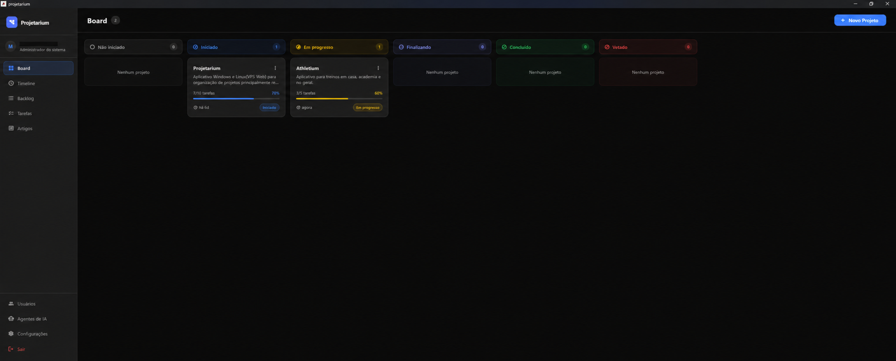
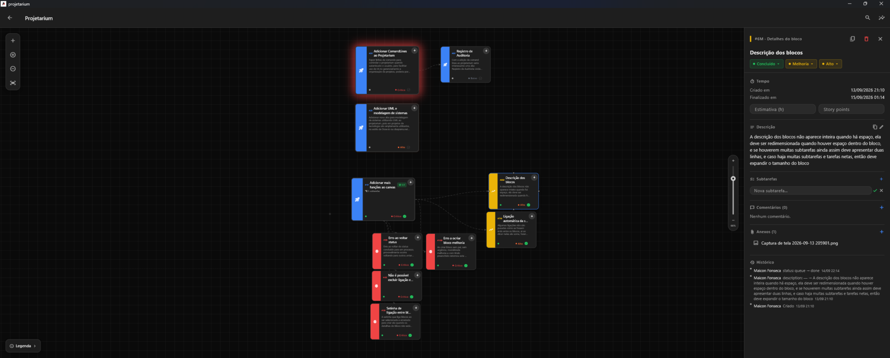
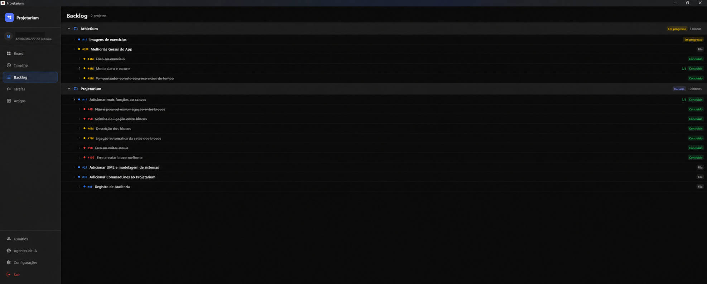
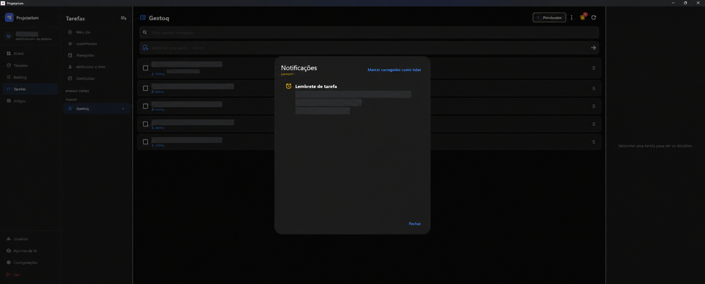

# Projetarium

O **Projetarium** é um aplicativo de gestão visual e documentação de projetos
de tecnologia. Ele reúne Board, Canvas, Backlog, Timeline, tarefas, artigos,
usuários e recuperação de dados em uma interface desktop focada em organizar
trabalho técnico sem obrigar o usuário a entregar seus dados a um serviço de
terceiros.

Este é o repositório público oficial de distribuição. O código-fonte permanece
privado; aqui serão publicados instaladores, hashes, notas de versão e os canais
comunitários de suporte.

## Download

**Ainda não existe um instalador público.** A versão `0.1.0-beta.1` está sendo
preparada e só aparecerá em [Releases](../../releases) depois dos testes de
instalação, atualização, remoção e preservação de dados em uma máquina limpa.

Quando houver um asset publicado, baixe apenas deste repositório e confira nas
notas da própria tag o nome do arquivo, o SHA-256 e as plataformas validadas.
Não obtenha o Projetarium por mirrors ou comandos enviados por terceiros.

## O que estará disponível na primeira beta

A primeira beta pública terá escopo **Windows Local**:

- Board com status de projeto e visão rápida do andamento;
- Canvas com pan, zoom, blocos, hierarquia, conexões, agrupamentos e setas de
  anotação;
- referências humanas por projeto, como `#44F`, sem expor o identificador
  técnico interno;
- detalhes de bloco com descrição, subtarefas aninhadas, comentários, anexos,
  estimativa, story points e histórico;
- cópia de dossiê saneado do bloco para comunicação com pessoas ou IA;
- Backlog hierárquico e Timeline dos projetos;
- listas de tarefas com notas, prioridade, prazo, lembrete, recorrência,
  responsáveis e central de notificações dentro do aplicativo;
- artigos vinculáveis a projetos;
- usuários locais e permissões por projeto;
- banco SQLite escolhido pelo usuário, exportação/importação e backups locais
  ou externos em uma pasta sincronizada;
- atalhos para suporte comunitário, sugestões e relatos privados de segurança.

O instalador, e não apenas o executável isolado, será a unidade suportada de
distribuição.

## Visão do aplicativo

| Board | Canvas e detalhes do bloco |
|---|---|
|  |  |

| Backlog hierárquico | Tarefas e notificações |
|---|---|
|  |  |

As capturas foram revisadas para divulgação; a tela de tarefas oculta o
conteúdo operacional que não faz parte da demonstração.

## Recursos experimentais

Os itens abaixo existem em diferentes estágios no código, mas **não fazem parte
da promessa da primeira beta Windows Local**:

| Recurso | Estado atual |
|---|---|
| Self-hosted com PostgreSQL | Implementação interna; promoção depende de smoke test real em VPS e pacote assinado |
| Aplicação Web | Build interno; será oferecido com a edição Self-hosted após validação |
| CLI autenticada | Consultas somente leitura e agentes restritos em validação interna |
| Agentes de IA | Identidades `reader` e `editor` existem, porém toda mutação continua bloqueada |
| Registro de auditoria | Ledger técnico em evolução; interface, busca, exportação e desfazer ainda não estão concluídos |

Recursos experimentais podem mudar e não devem ser usados como base para
automação de produção antes de uma release que os declare suportados.

## Roadmap, não disponível no download

Estes recursos continuam planejados e não são anunciados como concluídos:

- escrita segura pela CLI e por agentes, sempre sem permissão de exclusão;
- interface completa do Registro de Auditoria, exportação verificável e
  operações compensatórias de desfazer;
- editor de UML e modelagem de sistemas;
- aplicativo Linux desktop empacotado e testado;
- canal estável e atualização automatizada.

## Edição Local

No modo Local, os dados permanecem em um banco SQLite no computador. O usuário
escolhe a pasta do banco e pode configurar cópias automáticas em outro destino.

Não mantenha o arquivo `projetarium.db` ativo dentro de uma pasta sincronizada
pelo OneDrive, Google Drive ou serviço semelhante. Use uma pasta local para o
banco e selecione a pasta sincronizada somente como destino dos backups já
concluídos.

Antes de atualizar, restaurar ou repetir uma operação que possa afetar dados,
preserve uma cópia independente do banco e dos anexos.

## Plataformas

| Plataforma | Situação pública |
|---|---|
| Windows 10/11 x64 | Alvo da primeira beta |
| Web | Experimental, vinculada ao Self-hosted |
| Servidor Ubuntu/Debian | Experimental, ainda sem release promovida |
| Linux desktop | Roadmap; não confundir com o servidor Linux |
| macOS, Android e iOS | Não suportados |

## Instalação da beta Windows

Estas instruções passam a valer quando a tag `v0.1.0-beta.1` tiver um instalador
publicado:

1. Abra [Releases](../../releases) e leia as notas da versão.
2. Baixe o instalador Windows indicado na própria tag.
3. Compare o SHA-256 do arquivo com o valor publicado.
4. Execute o instalador completo e mantenha os componentes no local escolhido
   por ele.
5. Na primeira abertura, escolha **Local**, selecione uma pasta local para o
   banco e crie a conta administrativa.
6. Configure backups antes de cadastrar dados importantes.

Uma instalação ou atualização não deve apagar automaticamente bancos, anexos,
preferências ou backups. A comprovação desse comportamento faz parte do gate da
beta.

## Suporte e segurança

O suporte da edição freemium é comunitário e não possui SLA. Consulte o
[guia de suporte](SUPPORT.md) e use o formulário adequado:

- [reportar um problema](../../issues/new?template=bug_report.yml);
- [sugerir uma melhoria](../../issues/new?template=feature_request.yml);
- [reportar uma vulnerabilidade de forma privada](SECURITY.md).

Issues são públicas. Nunca publique banco, dump, `.env`, senha, token, chave,
URL interna, caminho completo, anexo real ou conteúdo de projeto.

## Versão, termos e componentes de terceiros

A identidade da primeira beta é:

| Campo | Valor |
|---|---|
| Produto | Projetarium |
| Publicador exibido | Projetarium |
| Canal | Beta |
| Versão | `0.1.0-beta.1` |
| Build inicial | `1` |

O uso dos binários oficiais é regido pelos [termos da distribuição
compilada](TERMS.md). Os componentes de terceiros e a forma de consultar suas
licenças estão descritos em [avisos de terceiros](THIRD_PARTY_NOTICES.md).

As mudanças e limitações específicas desta entrega estão no [rascunho das
notas da versão 0.1.0-beta.1](RELEASE_NOTES_0.1.0-beta.1.md).
